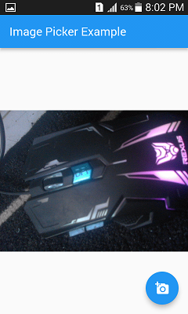
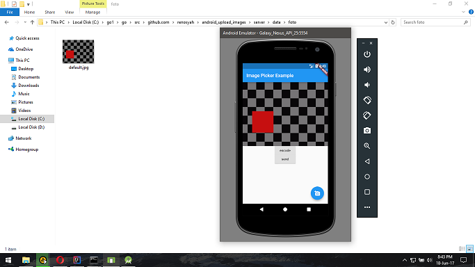

# send image from flutter app

* membuka aplikasi dan menekan tombol add image

* memilih gambar

* gambar akan ditampilkan sebagai preview

* mengirim gambar langsung dari aplikasi ke server dan gambar telah berada di server

server disini : 

    https://github.com/renosyah/android_upload_images